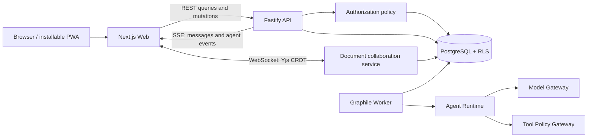

<div align="center">
  
  <h1>HaloAI</h1>
  <p><strong>Teams and AI, turning ideas into outcomes.</strong></p>
  <p>A shared workspace where teams and specialist AI collaborators chat, coordinate, and create live documents together.</p>

  <p>
    <a href="README.zh-CN.md">简体中文</a> ·
    <a href="docs/en-US/README.md">Documentation</a> ·
    <a href="docs/en-US/roadmap.md">Roadmap</a> ·
    <a href="docs/en-US/security.md">Security</a>
  </p>

  <p>
    
    
    
    
  </p>
</div>

---

## What is HaloAI?

HaloAI is a project-room-centered collaboration tool. People and named AI members discuss work, divide responsibilities, research authorized material, propose changes, and deliver a reviewable document in one shared context.

It combines two familiar interaction models:

- The clarity of modern team messaging: people, rooms, mentions, and messages.
- The capability of modern AI assistants: context understanding, streamed responses, controlled tools, and content creation.

HaloAI does not treat AI as an all-powerful input box or turn several agents into an unsupervised chat swarm. Every AI member has an explicit identity, responsibility, knowledge scope, budget, tool policy, and audit trail. People retain ownership of goals, authority, and final decisions.

## Core experience

```text
Create a workspace and project room
  → invite people and AI members
  → route work with @mentions or a facilitator
  → let AI research, verify, and draft within authorized context
  → surface changes as proposals and diffs in the shared document
  → review, edit, and approve as people
  → publish a versioned artifact with sources and ownership
```

### First-release target capabilities

- **People + multiple AI members** with explicit identity and independent permissions.
- **Quiet routing** where only mentioned AI responds by default.
- **Recoverable streaming** for preparation, generation, approval, completion, failure, and cancellation states.
- **Shared collaborative documents** with versions, comments, sources, and AI change proposals.
- **AI role management** across identity, duty, knowledge, tools, model, budget, and initiative.
- **Server-enforced policy** that keeps identity, access role, and AI persona separate.
- **Approvals and audit** for publishing, deletion, permission changes, and external side effects.
- **International and mobile-first interaction**, initially supporting `zh-CN` and `en-US`.
- **Provider-independent model adapters** so product identity never depends on one SDK.

## Project status

HaloAI is currently in the **Foundation / specification and framework phase**. Existing code validates the TypeScript architecture, authorization policy, event streaming, and responsive workspace. Interfaces and package boundaries may change until the product, domain, security, and UX specifications are reviewed.

| Area                                       | Status                  | Notes                                                                                                 |
| ------------------------------------------ | ----------------------- | ----------------------------------------------------------------------------------------------------- |
| Product, UX, security, architecture specs  | Draft 0.1 complete      | Full English/Chinese pairs with acceptance gates                                                      |
| pnpm TypeScript workspace                  | Established             | Strict types and independent domain packages                                                          |
| Actor / Role / AgentProfile                | Foundation implemented  | Identity, authority, persona, membership separated                                                    |
| Authorization policy and tests             | Foundation implemented  | Fail-closed server policy with delegation intersection                                                |
| API and durable worker                     | Framework implemented   | Fastify boundary, resumable SSE, Graphile task boundary                                               |
| Database schema                            | Foundation implemented  | Tenant-explicit collaboration, runtime and governance tables                                          |
| Responsive workspace                       | Foundation implemented  | Authenticated room search/create/switching, persisted messages, themes, mobile layout                 |
| Collaboration and workspace administration | Alpha shell implemented | Separate `/app` and `/admin/*` shells, server guards, bilingual copy, and mobile layouts              |
| CRDT collaboration service                 | Foundation implemented  | Yjs/Hocuspocus transport, ticket auth, revocation reconnect, persistence port                         |
| Provider-neutral model boundary            | Foundation implemented  | Streaming protocol and demo adapter; no live provider yet                                             |
| Real authentication and persistence        | Alpha connected         | Secure cookie sessions, sign-in, workspace onboarding, invitations, and role protection are connected |
| Rich-text editor and durable CRDT storage  | Not started             | Web/PostgreSQL integration in Team Beta                                                               |

> The current demo runtime calls no real model or external tool. It needs no API key and is not a claim of production readiness.

Real mode connects sign-up and sign-in, revocable database sessions, first-workspace creation, workspace switching, email-bound invitations, invitation acceptance, member listing, and role changes. The application transaction and a deferred database constraint both protect the final Owner. Local `DEMO_MODE=true` writes hashed seed accounts and collaboration fixtures into PostgreSQL; the web app no longer ships browser-side fake rooms, fake messages, or sample administration numbers. Sending a message persists through the API. Agent replies are not connected yet. Document bodies remain metadata-only until the editor lands.

## Technology direction

“TypeScript-only” means all application, domain, API, job, agent orchestration, and realtime collaboration services are implemented in TypeScript, with no Python, Go, or Java backend.

PostgreSQL, SQL migrations, CSS, Markdown, container configuration, and compiled browser JavaScript remain necessary supporting formats.

### Target stack

| Layer                | Technology                                  | Purpose                                                               | Phase                                            |
| -------------------- | ------------------------------------------- | --------------------------------------------------------------------- | ------------------------------------------------ |
| Runtime              | Node.js 22+, strict TypeScript, ESM         | One type system across client and server                              | Established                                      |
| Workspace            | pnpm workspace, Turborepo                   | Package boundaries, caching, parallel checks                          | Established                                      |
| Web / PWA            | Next.js App Router, React                   | Chat, documents, routing, SSR, PWA shell                              | Foundation                                       |
| API                  | Fastify, Zod                                | REST/SSE service, runtime contracts, auth hooks                       | Framework                                        |
| Authentication       | Better Auth                                 | Human login and database sessions; domain-owned workspace invitations | Alpha connected                                  |
| Database             | PostgreSQL, Drizzle ORM, Row-Level Security | Relational collaboration data and tenant isolation                    | Initial migration and collaboration repositories |
| Jobs                 | Graphile Worker, transactional outbox       | Durable retries, recovery, schedules, idempotency                     | Framework                                        |
| AI gateway           | Vercel AI SDK Core behind `ModelGateway`    | Multi-provider streaming and structured responses                     | Internal boundary built; live adapters planned   |
| Documents            | Tiptap, Yjs, Hocuspocus                     | Rich text, CRDT merge, presence, self-hosted sync                     | Collaboration service built; editor planned      |
| Realtime             | REST mutations, SSE, WebSocket              | Auditable writes, recoverable events, CRDT channel                    | SSE and CRDT service foundations built           |
| Internationalization | next-intl, ICU Message, Intl                | Typed copy, plurals, dates, route locale                              | Typed demo dictionaries; routing planned         |
| Testing              | Vitest, Playwright, axe-core                | Domain rules, multi-context E2E, visual and a11y                      | Unit and E2E foundations                         |
| Observability        | OpenTelemetry, structured audit events      | Trace people, agents, models, tools, approvals                        | Planned                                          |

The first usable release stays a modular monolith around one PostgreSQL instance. Redis, Temporal, a dedicated vector database, Kubernetes, and native mobile clients are intentionally deferred until identity, document, and agent authority are stable.

## Architecture overview



### Agent execution boundary

```text
A person sends a message with an @mention
  → API resolves workspace and membership from the server session
  → policy verifies room.message.create and agent.invoke
  → message, mentions, and outbox are written in one transaction
  → worker creates a run pinned to an immutable agent version
  → context builder reads authorized material only
  → model gateway streams persisted run events
  → every tool call re-checks current policy, budget, and approval
  → final output becomes an official message by the AI actor
  → document changes remain proposals until a person approves them
```

## Core domain model

- **Actor**: a `human | agent | system` identity that can speak or act.
- **Membership**: a human actor's scoped participation; AI room participation is an explicit resource relation.
- **AccessRole**: permissions over resources and actions.
- **AgentProfile / AgentVersion**: versioned duty, model, prompt, knowledge, tools, and budget.
- **Room / Message / Mention**: project conversations, immutable messages, explicit agent activation.
- **Document / Version / Proposal**: collaborative artifacts, checkpoints, and reviewable AI changes.
- **AgentRun / RunEvent / ToolCall**: cancellable, recoverable, auditable execution.
- **Approval**: a one-time authorization bound to exact parameters and expiry.
- **AuditEvent / UsageLedger**: append-only responsibility and model-cost facts.

An AI's effective capability is always the intersection of delegator access, AI grants, resource ACL, tool policy, data policy, and current approval state.

## Repository structure

```text
HaloAI/
├─ .github/workflows/      # Least-privilege quality and browser gates
├─ apps/
│  ├─ web/                 # Next.js responsive workspace, PWA shell, demo BFF
│  ├─ api/                 # Fastify REST/SSE boundary and security middleware
│  ├─ collab/              # Yjs/Hocuspocus document sync and authorization boundary
│  └─ worker/              # Durable Graphile Worker process and task boundary
├─ packages/
│  ├─ core/                # Domain types, invariants, base policy
│  ├─ contracts/           # Runtime-validated API and event contracts
│  ├─ agent-runtime/       # State machine, explicit routing, runtime port
│  ├─ model-gateway/       # Provider-neutral model streaming boundary
│  └─ db/                  # Multi-tenant Drizzle schema and persistence boundary
├─ docs/
│  ├─ en-US/              # English product and technical specifications
│  └─ zh-CN/              # 同名维护的中文产品与技术规格
├─ scripts/                # TypeScript repository verification
├─ tests/e2e/              # Desktop and mobile Playwright acceptance tests
├─ AGENTS.md               # Repository guidance for coding agents
├─ turbo.json
├─ pnpm-workspace.yaml
└─ tsconfig.base.json
```

Policy currently lives in `packages/core`; locale messages and visual primitives remain close to the Web application. They move into dedicated packages only when a second real consumer appears, avoiding empty abstraction layers.

## Local development

### Requirements

- Node.js 22+
- pnpm 9+
- Git

### Install and run

The default local loop requires PostgreSQL. Install dependencies and copy environment values once; after that a single command starts the database, migrates/seeds, and opens Web plus API.

```bash
git clone <your-repository-url>
cd HaloAI
pnpm install
cp .env.example .env.local
pnpm dev:local
```

Open `http://127.0.0.1:3000` and sign in with a local seed account such as `owner@haloai.dev`. The initial password is documented only in `packages/db/devdata/README.md`. Empty email or password can no longer enter the workspace.

`pnpm db:migrate` applies table structure only. `pnpm db:seed` writes `packages/db/devdata` when `DEMO_MODE=true`. Production must keep that switch off.

To also run the CRDT service and durable worker:

```bash
pnpm dev:local:all
```

`pnpm infra:down` stops the local service without deleting its named data volume.

### Environment

```bash
cp .env.example .env.local
```

| Variable                                            | Required            | Purpose                                                                                         |
| --------------------------------------------------- | ------------------- | ----------------------------------------------------------------------------------------------- |
| `API_HOST` / `API_PORT` / `API_WEB_ORIGIN`          | Optional            | API binding and exact browser origin                                                            |
| `COLLAB_HOST` / `COLLAB_PORT` / `COLLAB_WEB_ORIGIN` | Optional            | CRDT endpoint and exact WebSocket origin                                                        |
| `DEMO_MODE`                                         | Local seed / collab | Loads `packages/db/devdata` and collab demo tickets; never skips login; forbidden in production |
| `DEMO_TOKEN` / `DEMO_*`                             | Collaboration demo  | Fixed local ticket, actor, workspace, document, and access; requires `DEMO_MODE=true`           |
| `DATABASE_URL`                                      | Worker              | Server-only PostgreSQL application connection                                                   |
| `AUTH_DATABASE_URL`                                 | API                 | Authentication-only role for users, accounts, sessions, and verifications                       |
| `AUTH_BASE_URL` / `BETTER_AUTH_SECRET`              | API                 | Public auth origin and a server-only secret of at least 32 characters                           |
| `NEXT_PUBLIC_API_BASE_URL`                          | Web                 | Browser API origin; keep the same hostname as `API_WEB_ORIGIN`                                  |
| `DATABASE_ADMIN_URL`                                | Migration           | Migration process only; forbidden in API, Web, and Worker request paths                         |
| `DATABASE_TEST_URL` / `DATABASE_TEST_ADMIN_URL`     | Integration tests   | PostgreSQL security tests in local development and CI                                           |
| `OPENAI_API_KEY`                                    | Optional            | Read by the server-side provider adapter when enabled                                           |
| `ANTHROPIC_API_KEY`                                 | Optional            | Read by the server-side provider adapter when enabled                                           |

Run `pnpm dev:all` only after PostgreSQL is available and `.env.local` exists; it starts the API, collaboration service, and durable worker together.

Never commit real workspace keys or put them in browsers, prompts, or ordinary logs.

## Commands

```bash
pnpm dev:local    # Start PostgreSQL, migrate/seed, then open Web and API
pnpm dev:local:all # Same, plus the CRDT service and durable worker
pnpm dev          # Start Web and API only (database must already be ready)
pnpm dev:collab   # Start the CRDT service (complete demo config required)
pnpm infra:up     # Start local PostgreSQL 18 and wait until it is healthy
pnpm db:migrate   # Apply schema migrations with the separate migration connection
pnpm db:seed      # Load local virtual data when DEMO_MODE=true
pnpm db:setup     # Migrate, then seed when DEMO_MODE=true
pnpm db:test:integration # Verify RLS, idempotency, revocation, and tenant isolation
pnpm typecheck    # Type-check every workspace package
pnpm test         # Run domain and runtime tests
pnpm test:e2e     # Verify desktop, mobile, theme, locale, and collaboration flows
pnpm build        # Build every workspace package
pnpm check        # Check docs, formatting, types, unit tests, and builds
pnpm check:all    # Add browser end-to-end acceptance to the full check
```

Turborepo writes reusable task results to `.turbo/`. This directory is generated local cache, is ignored by Git, and contains no project source. It can be deleted safely to reclaim disk space or troubleshoot a stale cache; the next command recreates it automatically.

## Internationalization, mobile, and visual quality

- Initial locales: `zh-CN` and `en-US`; account preference wins over cookies and `Accept-Language`.
- APIs return stable error codes and arguments, never hard-coded display strings.
- Desktop centers rooms, conversation, and documents; tablet uses drawers; mobile uses a single-page stack.
- UI uses `100dvh`, safe-area, scalable viewport, 44px touch targets, and reduced-motion support.
- The “Halo” motif is a restrained AI identity and state signal—not a full-screen neon effect.
- Core views must pass Chinese/English, light/dark, 390×844, 768×1024, and 1440×900 review.

## Security principles

1. Tenant and project access is deny-by-default and fail-closed.
2. AI never holds human login tokens or gains authority through prompts.
3. Retrieval filters by ACL before content enters model context.
4. Model output, files, pages, and tool results are untrusted data.
5. Publishing, deletion, payment, external writes, and permission changes require approval.
6. Runs have token, cost, duration, step, and tool-call limits.
7. Credentials are injected at final server-side call sites only.
8. Audit records delegation, policy, model, tool, approval, and result without becoming a secret-content side channel.

Read the [security baseline](docs/en-US/security.md) before enabling real models, persistence, file upload, or external tools.

## Documentation

| English                                                            | 中文                                                  | Scope                                                |
| ------------------------------------------------------------------ | ----------------------------------------------------- | ---------------------------------------------------- |
| [Documentation index](docs/en-US/README.md)                        | [文档索引](docs/zh-CN/README.md)                      | Navigation and maintenance rules                     |
| [Product brief](docs/en-US/product-brief.md)                       | [产品概要](docs/zh-CN/product-brief.md)               | Audience, first job, principles                      |
| [Product requirements](docs/en-US/product-requirements.md)         | [产品需求](docs/zh-CN/product-requirements.md)        | Requirements, metrics, MVP acceptance                |
| [UX and visual](docs/en-US/ux-and-visual.md)                       | [用户体验与视觉](docs/zh-CN/ux-and-visual.md)         | Responsive behavior and quantified visual quality    |
| [Frontend surface boundaries](docs/en-US/frontend-surfaces.md)     | [前台与后台界面边界](docs/zh-CN/frontend-surfaces.md) | Collaboration, administration, and authorization     |
| [Domain model](docs/en-US/domain-model.md)                         | [领域模型](docs/zh-CN/domain-model.md)                | Actors, resources, invariants and lifecycle          |
| [Architecture](docs/en-US/architecture.md)                         | [系统架构](docs/zh-CN/architecture.md)                | Domain boundaries and evolution                      |
| [Technical decisions](docs/en-US/technical-decisions.md)           | [技术决策](docs/zh-CN/technical-decisions.md)         | Technology choices and replacement triggers          |
| [Persistence and tenant transactions](docs/en-US/persistence.md)   | [持久化与租户事务](docs/zh-CN/persistence.md)         | Database roles, migrations, RLS, and repositories    |
| [Realtime collaboration](docs/en-US/realtime-collaboration.md)     | [实时协作](docs/zh-CN/realtime-collaboration.md)      | SSE recovery, CRDT, presence and offline behavior    |
| [Agent runtime](docs/en-US/agent-runtime.md)                       | [Agent 运行时](docs/zh-CN/agent-runtime.md)           | State machine, tools, budgets and recovery           |
| [Security](docs/en-US/security.md)                                 | [安全基线](docs/zh-CN/security.md)                    | Authorization and launch gates                       |
| [Permissions and security](docs/en-US/permissions-and-security.md) | [权限与安全](docs/zh-CN/permissions-and-security.md)  | Permission matrix, tenant isolation and attack suite |
| [Internationalization](docs/en-US/internationalization.md)         | [国际化](docs/zh-CN/internationalization.md)          | Locale, ICU, content language and CI rules           |
| [Quality and testing](docs/en-US/quality-and-testing.md)           | [质量与测试](docs/zh-CN/quality-and-testing.md)       | Test layers and release gates                        |
| [Roadmap](docs/en-US/roadmap.md)                                   | [交付路线](docs/zh-CN/roadmap.md)                     | Foundation through enterprise                        |

## Development agreements

Read [AGENTS.md](AGENTS.md) before changing the codebase. Key rules include specification-first product changes, provider-independent domain code, complete Chinese comments for non-obvious behavior and security boundaries, typed user-facing copy, synchronized documentation pairs, and multi-viewport visual verification.

## Roadmap summary

- **Foundation**: freeze product, domain, security, and UX specifications; deliver a polished typed workspace.
- **Internal Alpha**: authentication, PostgreSQL, real room/document APIs, one model adapter.
- **Team Beta**: connect SSE and Yjs foundations to durable storage, then add multi-user editing, knowledge, and usage controls.
- **Controlled Action**: governed tools, MCP, isolated workers, approval center, enterprise controls.

See the full [roadmap](docs/en-US/roadmap.md).

## Contributing

The architecture is still forming. Discuss domain changes before implementing features so the repository does not grow a second identity, authorization, event, or agent runtime model.

Every contribution should keep English/Chinese content aligned, test policy and state-machine changes, and define tenant scope, permission actions, audit events, retention, and deletion paths for new resources.

## License

The license has not been selected. Do not assume redistribution or commercial-use rights until a license file is added.
