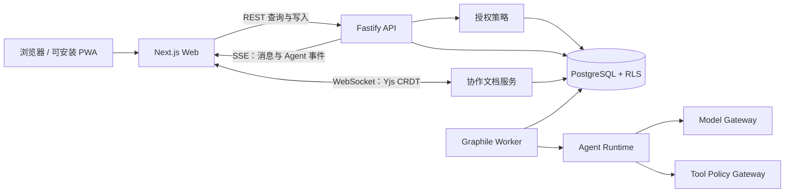

<div align="center">
  
  <h1>HaloAI</h1>
  <p><strong>团队与 AI 并肩，让想法成为成果。</strong></p>
  <p>一个让团队成员与专业 AI 协作者共同聊天、推进任务并编辑实时文档的共享工作空间。</p>

  <p>
    <a href="README.md">English</a> ·
    <a href="docs/zh-CN/README.md">文档</a> ·
    <a href="docs/zh-CN/roadmap.md">路线图</a> ·
    <a href="docs/zh-CN/security.md">安全基线</a>
  </p>

  <p>
    
    
    
    
  </p>
</div>

---

## HaloAI 是什么

HaloAI 是一个以项目房间为中心的协作工具。真实人员和具名的 AI 成员在同一上下文中讨论、分工、检索资料、提出修改，并共同交付一份可审阅、可追踪的文档。

它希望把两种已经非常自然的体验结合起来：

- 像现代团队聊天工具一样，人员、群组、提及和消息都清楚自然。
- 像现代 AI 助手一样，能够理解上下文、流式回答、调用受控工具并协助创作。

区别在于，HaloAI 不把 AI 当作一个万能输入框，也不把多个 AI 变成无人监管的自动聊天群。每个 AI 都必须有明确身份、职责、知识范围、预算、工具权限和审计记录；人始终负责目标、授权和最终决定。

## 核心体验

```text
创建工作空间与项目房间
  → 邀请人员和 AI 成员
  → 通过 @提及 或协调员模式分配工作
  → AI 在授权范围内研究、核验和撰写
  → 变更以提案和差异形式进入共享文档
  → 人员审阅、修改和批准
  → 形成带来源、版本与责任记录的正式成果
```

### 第一版目标能力

- **多人 + 多 AI 房间**：人员和 AI 都是第一类成员，但身份与权限清楚区分。
- **安静的协作路由**：默认只有被 `@` 的 AI 响应，避免 Agent 无限互相唤醒。
- **实时流式对话**：显示准备、生成、等待审批、完成、失败和取消等状态。
- **共享协作文档**：聊天旁直接编辑成果，支持版本、评论、来源和 AI 修改提案。
- **AI 角色管理**：名称、职责、知识、工具、模型、预算和主动程度独立配置。
- **服务端权限策略**：身份、访问角色和 AI 人设完全分离，缺少租户上下文时默认拒绝。
- **审批与审计**：外部写入、发布、删除、权限修改等敏感行为必须人工确认。
- **国际化与移动端**：首发 `zh-CN` / `en-US`，桌面、平板、手机重新组织信息，而不是简单缩放。
- **多模型适配**：产品领域不绑定单一模型 SDK，模型供应商可以按工作空间替换。

## 项目状态

HaloAI 目前处于 **Foundation / 规格与框架阶段**。现有代码用于验证纯 TypeScript、权限策略、流式事件和响应式工作台是否能形成一条完整链路；在产品、领域、安全和 UX 规格评审完成前，接口与目录仍可能调整。

| 范围                         | 状态              | 说明                                                               |
| ---------------------------- | ----------------- | ------------------------------------------------------------------ |
| 产品、UX、安全和架构规格     | Draft 0.1 完成    | 完整中英文对照与可执行验收门槛                                     |
| pnpm TypeScript 工作区       | 已建立            | 严格类型检查和独立领域包                                           |
| Actor / Role / AgentProfile  | Foundation 已实现 | 身份、权限、人设和房间成员关系分离                                 |
| 权限策略与测试               | Foundation 已实现 | 默认拒绝策略与委托权限交集                                         |
| API 与耐久 Worker            | 框架已实现        | Fastify 边界、可恢复 SSE 和 Graphile 任务边界                      |
| 数据库 schema                | Foundation 已实现 | 显式租户协作、运行时与治理数据表                                   |
| 响应式工作台                 | Foundation 已实现 | 房间搜索/创建/切换、独立消息、流式回复、文档版本、主题和移动端布局 |
| 前台与工作空间后台           | Alpha 骨架已实现  | `/app` 与 `/admin/*` 独立外壳、服务端权限守卫、双语与移动端布局    |
| CRDT 协作服务                | Foundation 已实现 | Yjs/Hocuspocus 传输、票据授权、撤权重连与持久化端口                |
| 供应商无关模型边界           | Foundation 已实现 | 流式协议和演示适配器；尚未连接真实供应商                           |
| 真实认证与数据库             | Alpha 进行中      | 数据库迁移、RLS 事务与协作 repository 已完成；认证和 API 待接入    |
| 富文本编辑器与耐久 CRDT 存储 | 未开始            | 进入团队 Beta 后接入 Web 与 PostgreSQL                             |

> 当前演示运行时不会调用真实模型或外部工具，因此不需要 API Key，也不代表已经达到生产安全等级。

当前页面不是纯静态稿。`/app` 是团队协作前台，`/admin/*` 是独立的工作空间后台，`/system` 默认保持锁定。房间、消息、成员和文档版本在浏览器内具有真实状态，演示回复由服务端路由通过 SSE 流式返回；但刷新页面会重置这些演示数据。PostgreSQL 迁移与首批协作 repository 已完成，当前页面尚未接入这些 API；登录、跨用户共享与长期保存仍需继续完成认证和 HTTP 数据链路。尚未接后端的操作会显示阶段说明，不会静默执行或伪装成功。

## 技术路线

“纯 TypeScript”在本项目中的定义是：所有应用层、领域层、API、后台任务、Agent 编排和实时协作服务都使用 TypeScript，不引入 Python、Go 或 Java 后端。

PostgreSQL、SQL migration、CSS、Markdown、容器配置和浏览器编译产物属于必要支撑形式。

### 目标技术栈

| 层级      | 技术                                        | 用途与选择理由                                         | 阶段                           |
| --------- | ------------------------------------------- | ------------------------------------------------------ | ------------------------------ |
| 运行环境  | Node.js 22+、TypeScript strict、ESM         | 统一服务端与前端类型，开启严格不变量检查               | 已建立                         |
| 工作区    | pnpm workspace、Turborepo                   | 管理应用、领域包、缓存和并行验证                       | 已建立                         |
| Web / PWA | Next.js App Router、React                   | 聊天与文档界面、服务端渲染、路由、PWA 外壳             | Foundation                     |
| API       | Fastify、Zod                                | 独立 REST/SSE 服务、输入输出契约和统一授权 hook        | 框架已建                       |
| 身份认证  | Better Auth                                 | 人类登录、会话、组织邀请；资源权限仍由 HaloAI 策略负责 | 计划中                         |
| 数据库    | PostgreSQL、Drizzle ORM、Row-Level Security | 关系化协作数据、租户隔离、审计和事务                   | 首个迁移与协作 repository 已建 |
| 后台任务  | Graphile Worker、Transactional Outbox       | 复用 PostgreSQL，提供重试、恢复、调度和幂等            | 框架已建                       |
| AI 网关   | Vercel AI SDK Core + 内部 `ModelGateway`    | 多供应商、流式输出、结构化响应；领域模型不绑定 SDK     | 内部边界已建，真实适配器计划中 |
| 文档编辑  | Tiptap、Yjs、Hocuspocus                     | 富文本体验、CRDT 并发合并、在线状态和自托管同步        | 协作服务已建，编辑器计划中     |
| 实时通信  | REST mutation、SSE、WebSocket               | 写操作可审计；AI/运行事件可恢复；文档使用 CRDT 通道    | SSE 与 CRDT 服务基础已建       |
| 国际化    | next-intl、ICU Message、Intl                | 类型化消息、复数/时间/数字格式和服务端路由             | 演示字典已类型化，路由待接入   |
| 测试      | Vitest、Playwright、axe-core                | 领域规则、多人浏览器上下文、视觉回归和无障碍           | 单元与端到端框架已建           |
| 可观测性  | OpenTelemetry、结构化审计事件               | 串联人员、Agent、模型、工具、审批和结果                | 计划中                         |

### 为什么 MVP 不立即引入更多基础设施

首个可用版本采用“模块化单体 + 一个 PostgreSQL”。MVP 暂不引入 Redis、Temporal、专用向量数据库、Kubernetes 或原生移动端，避免在身份、文档和 Agent 权限尚未稳定时提前增加分布式复杂度。

## 架构概览



### Agent 执行边界

```text
人类发送带 @提及 的消息
  → API 从服务端会话解析工作空间与成员身份
  → 权限策略验证 room.message.create / agent.invoke
  → 同一事务写入消息、mentions、outbox
  → Worker 创建固定版本的 Agent Run
  → Context Builder 只读取已授权资料
  → Model Gateway 流式产生运行事件
  → 工具调用前重新验证实时权限、预算和审批
  → 最终回复以 AI Actor 身份写入正式消息
  → 文档修改只产生提案，人员批准后才进入正文版本
```

## 核心领域模型

- **Actor**：可以发言和工作的主体，类型为 `human | agent | system`。
- **Membership**：Human Actor 在工作空间或项目中的成员身份；AI 通过显式资源关系加入房间。
- **AccessRole**：决定主体可以对哪些资源执行哪些动作。
- **AgentProfile / AgentVersion**：AI 的职责、模型、提示词、知识、工具和预算版本。
- **Room / Message / Mention**：项目对话、不可变消息和明确的 AI 唤醒关系。
- **Document / Version / Proposal**：协作文档、正式版本和待批准的 AI 修改。
- **AgentRun / RunEvent / ToolCall**：可取消、可恢复、可审计的执行状态。
- **Approval**：绑定具体操作、参数摘要、审批人和有效期的人工授权。
- **AuditEvent / UsageLedger**：仅追加的责任链和模型费用账本。

身份、访问角色和 AI 人设不能互相替代。AI 的最终有效能力始终是发起人权限、AI 授权、资源 ACL、工具策略、数据策略和审批状态的交集。

## 目录结构

```text
HaloAI/
├─ .github/workflows/      # 最小权限的质量与浏览器验收门禁
├─ apps/
│  ├─ web/                 # Next.js 响应式工作台、PWA 外壳与演示 BFF
│  ├─ api/                 # Fastify REST/SSE 边界与安全中间件
│  ├─ collab/              # Yjs/Hocuspocus 文档同步与授权边界
│  └─ worker/              # Graphile Worker 耐久任务进程与执行边界
├─ packages/
│  ├─ core/                # 领域类型、不变量与基础授权策略
│  ├─ contracts/           # 带运行时校验的 API 与事件契约
│  ├─ agent-runtime/       # 状态机、显式路由与运行时端口
│  ├─ model-gateway/       # 与供应商无关的模型流式边界
│  └─ db/                  # Drizzle 多租户 schema 与持久化边界
├─ docs/
│  ├─ zh-CN/              # 中文产品与技术规格
│  └─ en-US/              # 使用同名文件维护的英文规格
├─ scripts/                # TypeScript 仓库验证脚本
├─ tests/e2e/              # 桌面与移动端 Playwright 验收
├─ AGENTS.md               # 面向编码 Agent 的仓库约束
├─ turbo.json
├─ pnpm-workspace.yaml
└─ tsconfig.base.json
```

权限策略目前位于 `packages/core`，国际化消息与视觉基础组件靠近 Web 应用维护。只有出现第二个真实消费者时才拆成独立包，避免提前制造空抽象层。

## 本地启动

### 环境要求

- Node.js 22 或更高版本
- pnpm 9 或更高版本
- Git

默认 Web/API 演示不要求 Docker、PostgreSQL 或模型密钥；启动 Worker 与持久化链路时需要 PostgreSQL。

### 安装与运行

```bash
git clone <your-repository-url>
cd HaloAI
pnpm install
pnpm dev
```

打开 `http://localhost:3000`。

如需验证耐久 Worker 与持久化边界，先启动本地 PostgreSQL：

```bash
pnpm infra:up
pnpm dev:all
```

`pnpm infra:down` 会停止本地服务，但不会删除命名数据卷。

### 环境变量

```bash
cp .env.example .env.local
```

| 变量                                                | 是否必填     | 说明                                                           |
| --------------------------------------------------- | ------------ | -------------------------------------------------------------- |
| `API_HOST` / `API_PORT` / `API_WEB_ORIGIN`          | 可选         | API 监听地址与精确允许的浏览器来源                             |
| `COLLAB_HOST` / `COLLAB_PORT` / `COLLAB_WEB_ORIGIN` | 可选         | CRDT 服务入口与精确 WebSocket Origin                           |
| `DEMO_*`                                            | 协作演示必填 | 固定本地 ticket、Actor、工作空间、文档和访问级别；生产环境禁止 |
| `DATABASE_URL`                                      | Worker 必填  | PostgreSQL 应用连接，仅服务端使用                              |
| `DATABASE_ADMIN_URL`                                | 迁移必填     | 仅迁移进程使用；不得进入 API、Web 或 Worker 请求路径           |
| `DATABASE_TEST_URL` / `DATABASE_TEST_ADMIN_URL`     | 集成测试     | 仅本地与 CI 的 PostgreSQL 安全测试                             |
| `OPENAI_API_KEY`                                    | 可选         | 对应供应商适配器启用后由服务端密钥代理读取                     |
| `ANTHROPIC_API_KEY`                                 | 可选         | 对应供应商适配器启用后由服务端密钥代理读取                     |

只有 PostgreSQL 已可用且已复制 `.env.local` 时才运行 `pnpm dev:all`；该命令会同时启动 API、协作服务和耐久 Worker。

不要把工作空间或 Agent 的实际密钥提交到 Git，也不要把它们发送到浏览器、提示词或普通日志。

## 常用命令

```bash
pnpm dev          # 启动 Web 开发环境
pnpm dev:collab   # 启动 CRDT 协作服务（需要完整 Demo 配置）
pnpm infra:up     # 启动本地 PostgreSQL 18
pnpm db:migrate   # 使用独立迁移连接执行待处理迁移
pnpm db:test:integration # 验证 RLS、幂等、撤权与租户隔离
pnpm typecheck    # 检查所有 TypeScript 包
pnpm test         # 运行领域与运行时测试
pnpm test:e2e     # 验收桌面端、移动端、主题、语言和 SSE
pnpm build        # 构建所有工作区包
pnpm check        # 检查文档、格式、类型、单元测试和构建
pnpm check:all    # 在 check 基础上追加浏览器端到端验收
```

Turborepo 会把可复用的任务结果写入 `.turbo/`。它是自动生成的本地缓存目录，已被 Git 忽略，不属于项目源码；需要释放空间或排查缓存问题时可以安全删除，下次运行命令会自动重新生成。

## 国际化、移动端和视觉标准

- 首发语言为 `zh-CN` 与 `en-US`，用户设置优先于 Cookie 和 `Accept-Language`。
- API 只返回稳定错误码与参数，不返回硬编码展示文案。
- 桌面端以房间、对话和文档为核心；平板使用抽屉和单主视图；手机使用单页栈。
- 界面使用 `100dvh`、safe-area、可缩放 viewport、44px 触摸目标和 `prefers-reduced-motion`。
- “Halo”视觉只用于 AI 身份、运行状态和重要提案的克制高光，不能变成满屏霓虹渐变。
- 核心页面必须在中英文、明暗主题、390×844、768×1024 和 1440×900 下通过视觉检查。

## 安全原则

1. 所有租户和项目访问默认拒绝，缺少上下文时禁止查询全库。
2. AI 永不持有人类登录令牌，也不能通过提示词扩大权限。
3. 检索先做 ACL 过滤，再进入模型上下文。
4. 模型输出、附件、网页和工具结果都按不可信数据处理。
5. 外部写入、发布、删除、付款和权限修改必须审批。
6. Agent 运行具有 token、费用、时长、步骤和工具调用上限。
7. 凭据只在服务端最终调用点注入，禁止进入消息、队列载荷或日志。
8. 审计记录委托人、AI 身份、策略版本、模型、工具、审批和结果，但不旁路保存完整秘密。

真实模型、数据库、文件上传或外部工具启用前，必须达到 [安全基线](docs/zh-CN/security.md) 中的上线门槛。

## 文档

| 中文                                                  | English                                                            | 内容                                |
| ----------------------------------------------------- | ------------------------------------------------------------------ | ----------------------------------- |
| [文档索引](docs/zh-CN/README.md)                      | [Documentation](docs/en-US/README.md)                              | 文档导航与维护规则                  |
| [产品概要](docs/zh-CN/product-brief.md)               | [Product brief](docs/en-US/product-brief.md)                       | 用户、首个任务和产品原则            |
| [产品需求](docs/zh-CN/product-requirements.md)        | [Product requirements](docs/en-US/product-requirements.md)         | 功能、指标与 MVP 验收               |
| [用户体验与视觉](docs/zh-CN/ux-and-visual.md)         | [UX and visual](docs/en-US/ux-and-visual.md)                       | 响应式行为与量化美观标准            |
| [前台与后台界面边界](docs/zh-CN/frontend-surfaces.md) | [Frontend surface boundaries](docs/en-US/frontend-surfaces.md)     | 前台、后台路由、视觉与授权边界      |
| [领域模型](docs/zh-CN/domain-model.md)                | [Domain model](docs/en-US/domain-model.md)                         | Actor、资源、不变量与生命周期       |
| [系统架构](docs/zh-CN/architecture.md)                | [Architecture](docs/en-US/architecture.md)                         | 领域边界和演进路径                  |
| [技术决策](docs/zh-CN/technical-decisions.md)         | [Technical decisions](docs/en-US/technical-decisions.md)           | 技术选型与替换触发条件              |
| [持久化与租户事务](docs/zh-CN/persistence.md)         | [Persistence](docs/en-US/persistence.md)                           | 数据库角色、迁移、RLS 与 Repository |
| [实时协作](docs/zh-CN/realtime-collaboration.md)      | [Realtime collaboration](docs/en-US/realtime-collaboration.md)     | SSE 恢复、CRDT、Presence 与离线行为 |
| [Agent 运行时](docs/zh-CN/agent-runtime.md)           | [Agent runtime](docs/en-US/agent-runtime.md)                       | 状态机、工具、预算与恢复            |
| [安全基线](docs/zh-CN/security.md)                    | [Security](docs/en-US/security.md)                                 | 权限、提示词注入和上线门槛          |
| [权限与安全](docs/zh-CN/permissions-and-security.md)  | [Permissions and security](docs/en-US/permissions-and-security.md) | 权限矩阵、租户隔离与攻击测试        |
| [国际化](docs/zh-CN/internationalization.md)          | [Internationalization](docs/en-US/internationalization.md)         | Locale、ICU、内容语言与 CI 规则     |
| [质量与测试](docs/zh-CN/quality-and-testing.md)       | [Quality and testing](docs/en-US/quality-and-testing.md)           | 测试分层与发布门禁                  |
| [交付路线](docs/zh-CN/roadmap.md)                     | [Roadmap](docs/en-US/roadmap.md)                                   | Foundation 到企业部署阶段           |

## 开发约束

修改代码前请完整阅读 [AGENTS.md](AGENTS.md)。重要要求包括：

- 先补规格和验收条件，再改变产品边界。
- 领域代码不依赖具体 UI、数据库和模型 SDK。
- 复杂状态机、安全边界和非显然取舍使用完整中文注释。
- 所有用户可见文案进入类型化国际化目录。
- `docs/zh-CN/` 与 `docs/en-US/` 使用相同文件名并保持语义同步。
- 重要交付前运行 `pnpm check` 并完成多视口视觉验收。

## 路线图摘要

- **Foundation**：冻结产品、领域、安全和 UX 规格，完成产品级工作台与类型化框架。
- **Internal Alpha**：接入认证、PostgreSQL、真实消息/文档 API 和一个模型适配器。
- **Team Beta**：把 SSE 与 Yjs 基础接入真实持久化，增加多人编辑、知识与用量控制。
- **Controlled Action**：增加受控工具、MCP、隔离 Worker、审批中心和企业治理。

详细计划见 [交付路线](docs/zh-CN/roadmap.md)。

## 贡献

当前仍处于架构形成期。提交功能前建议先通过 Issue 或设计文档确认领域边界，避免创建第二套身份、权限、事件或 Agent 运行模型。

提交代码时请确保：

1. 中英文文案和文档保持一致。
2. 权限、路由、验证和状态机变更包含测试。
3. 新资源同时定义租户字段、权限动作、审计事件、保留期和删除路径。
4. 新工具同时定义风险等级、凭据范围、网络策略、审批规则和攻击测试。

## 许可证

许可证尚未确定。在正式添加许可证文件前，请不要假设本仓库代码可用于再分发或商业用途。
